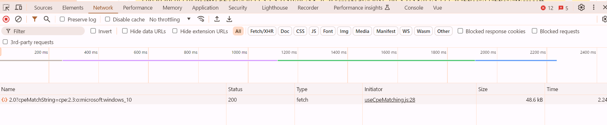
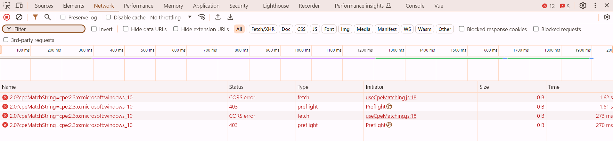

# Nuxt3の$fetchでCORSエラー対応を行う。

## CORSエラー発生状況
* $fetchにて、NVD API (https://services.nvd.nist.gov/rest/json/cpes/2.0)にGET要求したとき
* エラー発生頻度
    * apiKeyヘッダあり：毎回
        * API_KEY=36d60302-e1bb-453b-b679-6828010ec8d9
    * apiKeyヘッダなし：時々

* 成功時
    * chromeデバッグツール(Ctrl + Shift + i)の「Network」情報
        * ブラウザは単純リクエストとしてGETを実行
            

        * request-headers
            ```
            GET /rest/json/cpes/2.0?cpeMatchString=cpe:2.3:o:microsoft:windows_10 HTTP/1.1
            Accept: */*
            Accept-Encoding: gzip, deflate, br, zstd
            Accept-Language: ja,en-US;q=0.9,en;q=0.8,zh-TW;q=0.7,zh;q=0.6
            Connection: keep-alive
            Host: services.nvd.nist.gov
            Origin: http://localhost:3000
            Referer: http://localhost:3000/
            Sec-Fetch-Dest: empty
            Sec-Fetch-Mode: cors
            Sec-Fetch-Site: cross-site
            User-Agent: Mozilla/5.0 (Windows NT 10.0; Win64; x64) AppleWebKit/537.36 (KHTML, like Gecko) Chrome/125.0.0.0 Safari/537.36
            sec-ch-ua: "Google Chrome";v="125", "Chromium";v="125", "Not.A/Brand";v="24"
            sec-ch-ua-mobile: ?0
            sec-ch-ua-platform: "Windows"
            ```
        
        * response-headers
            ```
            HTTP/1.1 200 OK
            content-type: application/json
            x-frame-options: SAMEORIGIN
            access-control-allow-origin: *
            access-control-allow-headers: accept, apiKey, content-type, origin, x-requested-with
            access-control-allow-methods: GET, HEAD, OPTIONS
            access-control-allow-credentials: false
            date: Thu, 30 May 2024 04:00:03 GMT
            content-length: 48223
            apikey: Nos
            strict-transport-security: max-age=31536000
            ```

* CORSエラー発生時
    * chromeデバッグツール(Ctrl + Shift + i)の「Console」情報

        ```
        Access to fetch at 'https://services.nvd.nist.gov/rest/json/cpes/2.0?cpeMatchString=cpe:2.3:o:microsoft:windows_10' from origin 'http://localhost:3000' has been blocked by CORS policy: No 'Access-Control-Allow-Origin' header is present on the requested resource. If an opaque response serves your needs, set the request's mode to 'no-cors' to fetch the resource with CORS disabled.
        ```

    * chromeデバッグツール(Ctrl + Shift + i)の「Network」情報
        * ブラウザはprefligth requestを実行
            * commonヘッダを付与したことにより、[単純リクエスト](https://developer.mozilla.org/ja/docs/Web/HTTP/CORS#%E5%8D%98%E7%B4%94%E3%83%AA%E3%82%AF%E3%82%A8%E3%82%B9%E3%83%88)ではなくなった。

            
            

        * request-headers (fetch)
        
            ```
            Provisional headers are shown... 
            
            Apikey:  xxxxxxxxxxxxxxxxxxxxxxxxxxxxxxxx
            Referer: http://localhost:3000/
            Sec-Ch-Ua: "Not/A)Brand";v="8", "Chromium";v="126", "Google Chrome";v="126"
            Sec-Ch-Ua-Mobile: ?0
            Sec-Ch-Ua-Platform: "Windows"
            User-Agent: Mozilla/5.0 (Windows NT 10.0; Win64; x64) AppleWebKit/537.36 (KHTML, like Gecko) Chrome/126.0.0.0 Safari/537.36
            ```

        * request-headers (preflight)
            ```
            OPTIONS /rest/json/cpes/2.0?cpeMatchString=cpe:2.3:o:microsoft:windows_10 HTTP/1.1
            Accept: */*
            Accept-Encoding: gzip, deflate, br, zstd
            Accept-Language: ja,en-US;q=0.9,en;q=0.8,zh-TW;q=0.7,zh;q=0.6
            Access-Control-Request-Headers: common
            Access-Control-Request-Method: GET
            Connection: keep-alive
            Host: services.nvd.nist.gov
            Origin: http://localhost:3000
            Referer: http://localhost:3000/
            Sec-Fetch-Dest: empty
            Sec-Fetch-Mode: cors
            Sec-Fetch-Site: cross-site
            User-Agent: Mozilla/5.0 (Windows NT 10.0; Win64; x64) AppleWebKit/537.36 (KHTML, like Gecko) Chrome/126.0.0.0 Safari/537.36
            ```

## CORSエラー